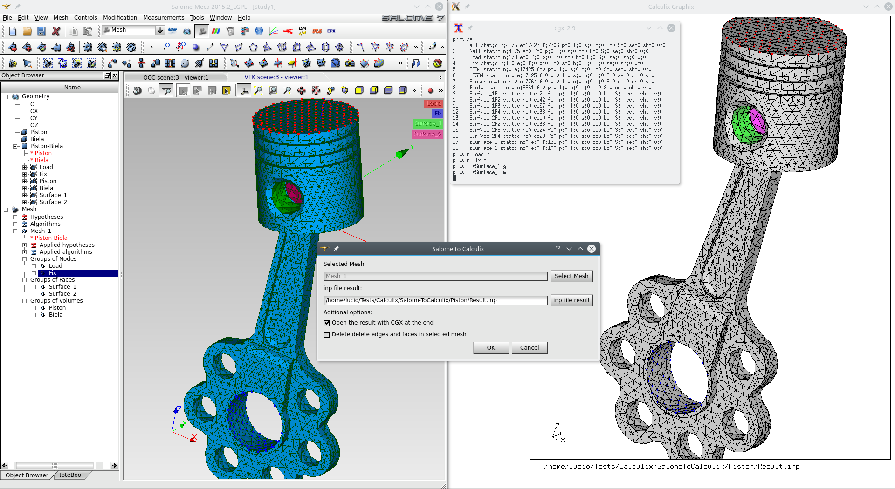
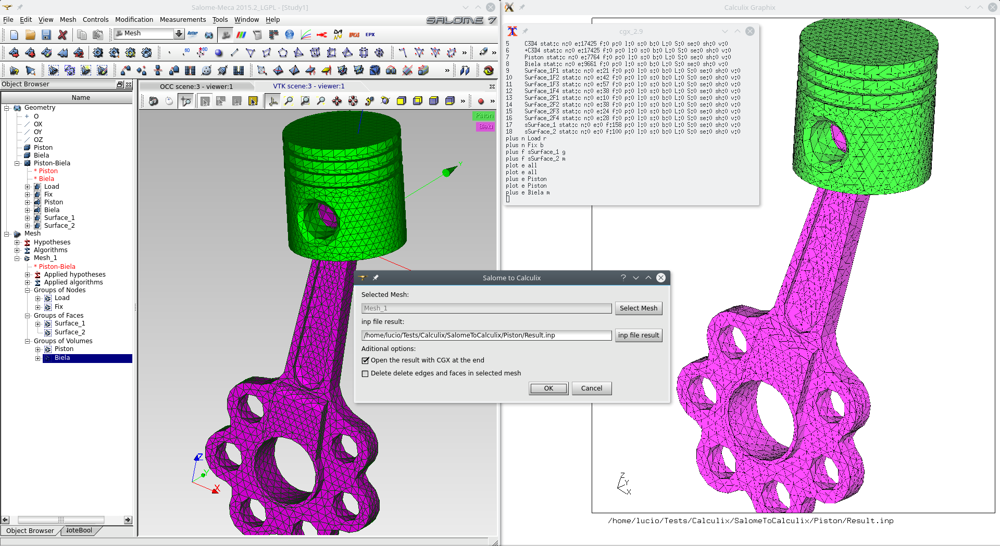

# salomeToCalculix

A python script that outputs a Salome mesh to Calculix using unical converter for Bernhardi, Aug 2011

To run: 
* First configure the unical binary in the configuration line inside of salomeToCalculix.py
* You can get the binary code unical compiling the source as indicated in the instructions on unical_1b.c which it is a modified version of unical2 provided by rafal brzegowy

* Then select the mesh you wish to export and go to file->load script and run salomeToCalculix.py
* Read unical c code for more information

# Optional

* You can configure CGX binary location inside of salomeToCalculix.py and launch cgx after the mesh convert

Old Youtube Video version: https://www.youtube.com/watch?v=yxqawAr1H3s
    
